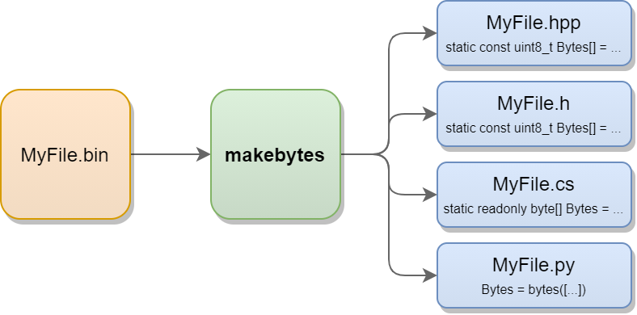

# makebytes
A command-line tool to generate byte arrays from binary files for various programming languages.

## Why?

Sometimes your just want to embed the raw data of a file directly into an executable via byte arrays. This tool does exactly what you ask for. Currently implemented output languages are:

- C
- C++
- C#
- Python
- Java

## Usage

Example command line to generate a C++ header named _MyFile.hpp_ from a file called _MyFile.bin_, where the bytes are stored in a variable named _MyBytes_:

``
makebytes cpp="MyBytes;C:/OutPath/MyFile.hpp" "C:/InPath/MyFile.bin"
``

To generate a C# file where the byte array resides in namespace _MyNamespace_ and is called _MyBytes_, the command line would be as follows:

``
makebytes csharp="MyNamespace:MyBytes;C:/OutPath/MyFile.cs" "C/InPath/MyFile.bin"
``

## How to build

Just use CMake and prepare your C++ 17 compiler.

## Contributing / Extending

Adding a new output language is pretty simple. All you have to do is add a method to the `Generator` class (see `Generator.h` / `Generator.cpp`) and call it from within `Generator::Generate`. Contributions are of course welcome.

